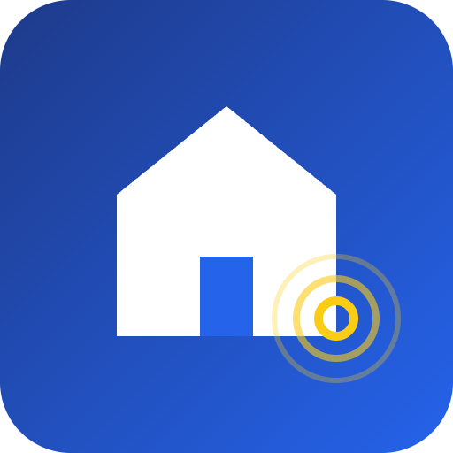

# EstateTap


One-tap investing in tokenized real estate, as easy as a mobile banking app.

## Overview
EstateTap lets anyone buy fractional shares of real estate properties on Solana with a single tap. Instead of seed phrases and crypto wallets, users log in with email or social accounts, fund their account with fiat or stablecoins, and instantly own a piece of real estate. Rent income flows back to holders automatically, and a simple dashboard shows ownership and yield in real time.

## Problem
Real estate investing and crypto onboarding are both complex. Seed phrases, wallet setup, and on-chain jargon scare off everyday investors from real-world asset (RWA) opportunities, even when the underlying investment itself is simple and familiar.

## Solution
EstateTap abstracts away wallets and crypto complexity. Embedded wallets, fiat on-ramps, and one-tap purchases let users invest in tokenized property shares with the same ease as a mobile banking app, while Solana handles settlement and rent distribution under the hood.

## Features (MVP)
- Email/social login creates an embedded Solana wallet automatically
- One-tap purchase of fractional property tokens with fiat or USDC
- Automatic rent distribution to holders via Solana Pay
- Simple portfolio dashboard showing ownership percentage and yield history
- Demo property with mock SPV data pre-loaded for investor testing

## Tech Stack
- Solana, Anchor, SPL Token
- Solana Pay for payments and rent distribution
- Privy / Web3Auth for embedded wallets
- Next.js for the frontend
- Helius RPC for reliable on-chain data access

## How It Works
```
[User] --email/social login--> [Embedded Wallet Created]
 |
 v
[Fiat or USDC] --one tap--> [Buy Fractional Property Tokens (SPL, Anchor)]
 |
 v
 [Solana Program]
 |
 v
[Rent Collected] --Solana Pay--> [Auto-distributed to Holder Wallets]
 |
 v
 [Dashboard: Ownership % + Yield History, via Helius RPC]
```

## Roadmap
- Partner with a licensed SPV/tokenization provider for real legal compliance
- Add a secondary marketplace for reselling fractional shares
- Expand to multiple property types and geographies

## Pitch
See the full pitch deck at [docs/pitch.pdf](docs/pitch.pdf) and the spoken pitch script at [docs/pitch-script.md](docs/pitch-script.md).

## Team
- Name / Role — [link]
- Name / Role — [link]
- Name / Role — [link]

Built for the Colosseum hackathon (Solana and other chains).

---

🎬 Pitch video: [docs/pitch-video.mp4](docs/pitch-video.mp4)
